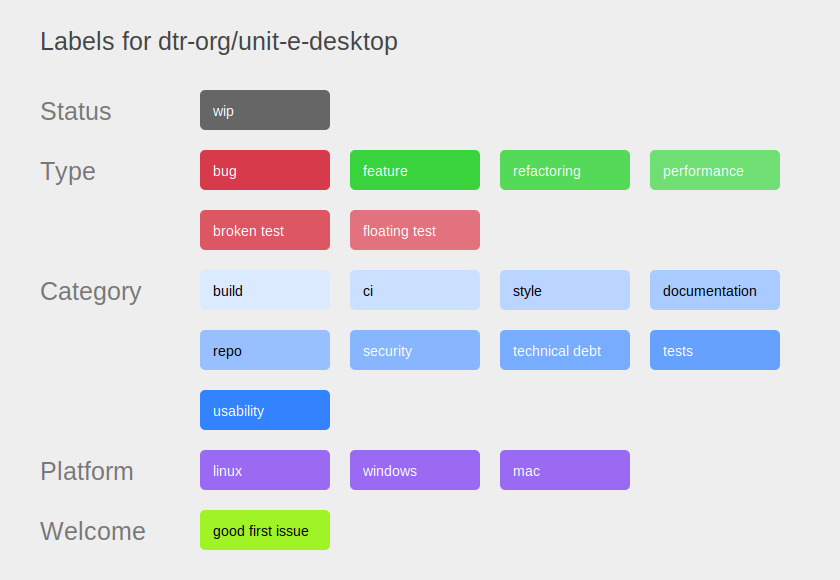

This directory contains the label configuration for the unit-e repositories. The
labels can be changed on GitHub from the YAML configuration via the API using
the [beautiful-labels](https://github.com/cornelius/beautiful-labels) script and
Terraform.

The configuration for the `unit-e` repository currently is in the [repository
itself](https://github.com/dtr-org/unit-e/tree/master/.github/labels).

It would be nice to merge the configuration of all repositories. This would
eliminate duplication of shared labels and make it possible to configure all
labels across repositories with one Terraform run.

Here is an overview of all the labels used:

[unit-e](https://github.com/dtr-org/unit-e/blob/master/.github/labels/dtr-org-unit-e-labels.svg)

